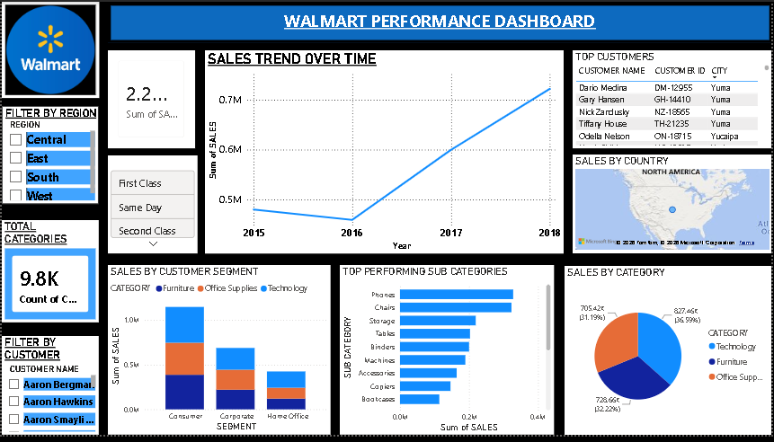

# 🛒 Walmart Sales Analysis Dashboard

## 📌 Project Overview
This project is an interactive Power BI dashboard created to analyze Walmart sales data. It provides insights into sales performance, profit trends, customer behavior, and regional performance.

## 🛠️ Tools Used
- Power BI
- Microsoft Excel

## 📊 Dashboard Features
- Sales Analysis
- Profit Analysis
- Customer Insights
- Category-wise Performance
- Interactive Filters & Slicers

## 📷 Dashboard Preview

## 🎯 Key Insights
- Identified top-performing product categories.
- Compared sales and profit across different regions.
- Built an interactive dashboard for business decision-making.

## 👩‍💻 Created By
**Keshar Ujjwal**
